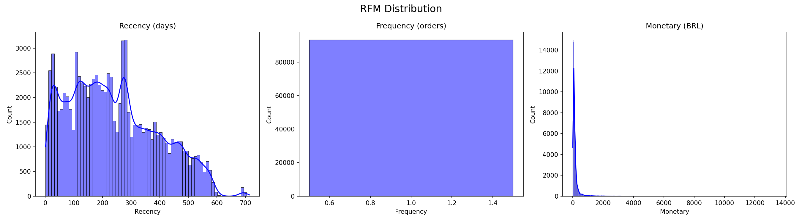
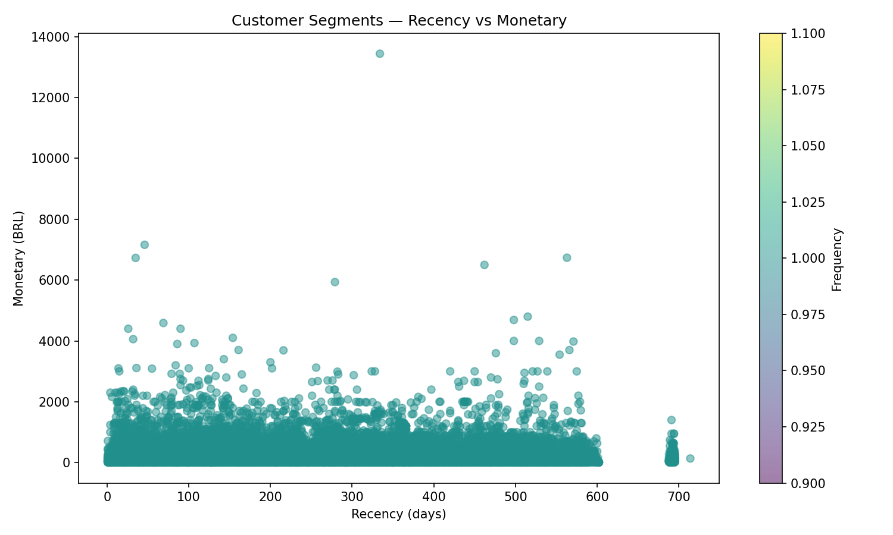
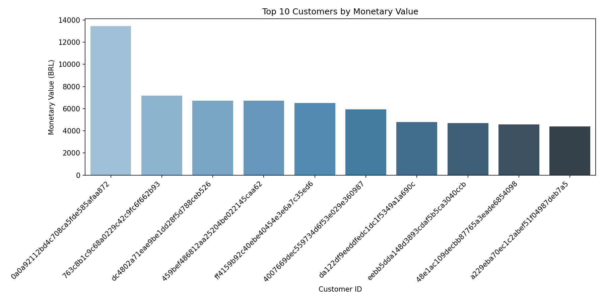

# Customer Segmentation using RFM Analysis & KMeans Clustering

## Overview
This project performs end-to-end customer segmentation on 100,000+ real e-commerce transactions from Olist (Brazil). Using RFM Analysis combined with KMeans Clustering, customers are grouped into meaningful business segments to help drive targeted marketing strategies.

## Business Problem
E-commerce companies struggle to personalize their marketing due to large customer bases. This project answers:
- Who are our most valuable customers?
- Which customers are at risk of churning?
- How should we allocate our marketing budget?

## Dataset
- **Source:** [Brazilian E-Commerce Public Dataset by Olist](https://www.kaggle.com/datasets/olistbr/brazilian-ecommerce)
- **Size:** 100,000+ orders | 96,000+ unique customers
- **Period:** 2016–2018

## Tech Stack
- **Language:** Python 3.11
- **Data Processing:** Pandas, NumPy
- **Database:** SQLite3 (in-memory SQL queries)
- **Machine Learning:** Scikit-learn (KMeans, StandardScaler)
- **Visualization:** Matplotlib, Seaborn

## Project Structure
```
customer-segmentation-rfm/
├── data/
│   ├── raw/          # Original Olist CSV files
│   └── processed/    # RFM scores output
├── outputs/
│   └── plots/        # Generated visualizations
├── sql/
│   └── rfm_query.sql # SQL queries for RFM calculation
├── src/
│   ├── data_cleaning.py    # Data loading & cleaning
│   ├── rfm_calculator.py   # RFM calculation & KMeans clustering
│   └── visualizations.py   # Plot generation
├── main.py           # Entry point — runs full pipeline
└── requirements.txt
```

## How to Run
```bash
# 1. Clone the repository
git clone https://github.com/yourusername/customer-segmentation-rfm.git

# 2. Install dependencies
pip install -r requirements.txt

# 3. Add Olist dataset CSV files to data/raw/

# 4. Run the pipeline
python main.py
```

## Results
| Segment | Customers | Description |
|---------|-----------|-------------|
| **VIP** | 2,230 | High spenders, recent & frequent buyers |
| **Loyal** | 34,890 | Regular customers with decent spend |
| **At-Risk** | 34,597 | Previously active, now inactive |
| **Lost** | 21,546 | Haven't purchased in a long time |

## Key Insights
- Only **2.4% of customers** are VIP — but they drive the most revenue
- **37%** of customers are At-Risk — targeted re-engagement campaigns needed
- Most customers purchase **only once** — loyalty programs could help retention

## Visualizations

### RFM Distribution


### Customer Segments


### Top Customers

## Author
Made with purpose by Sakshi

